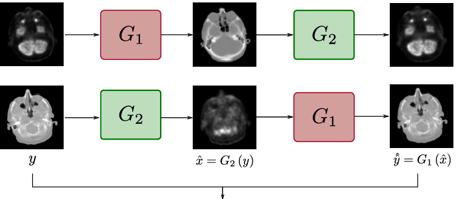

# Style-Transfer-using-GAN-for-Brain-MRI
A project dedicated to understand GAN and to experimenting with Style GAN to generate Brain MRI images with different contrasts.

## Problem Statement:
Sometimes, to ensure a better diagnosis of patients, doctors may need to look at multiple MRI scans. Different MRIs are required for different abnormalities. A single type of MRI may not be sufficient for the diagnosis of an abnormality. Additional MRIs might enhance the accuracy of diagnosis, leading to better treatment of the patient. Access to different imaging techniques is difficult and expensive. Moreover, doctors may advise getting one type of MRI to be done at a time, which makes it a time-consuming process.

Generative Adversarial Networks (GANs) have been used for generating deepfakes, new fashion styles and high-resolution pictures from the low-resolution ones. GANs can be used in the field of medical science, for instance, to create a different type of MRI from an existing one. In this project, a particular variant of GANs, called CycleGAN, is used to translate the style of one MRI scan into another, such as T1-weighted to T2-weighted or vice versa.

## Basics of a GAN

### Components of GAN
<b>1. Discriminator :</b> A classifier network that identfies whether a generated data (say, image) is fake or not.  
<b>2. Generator :</b> A network that generates fake data (say, image) from random noise samples. It's objective is to generate surreal data and fool the discriminator network.
### Loss & Objective Function
<b>1. Discriminator Loss = </b> The loss associated with classifying the real-image and the generated fake image.   
<b>2. Generator Loss = </b> The loss associated with generating the fake image, to make it look surreal, .i.e. exclusively on the generator output.   
<b>3. Objective Function </b>
 
-> Here, we have to maximize the likelihood for discriminator being wrong  
-> The discriminator tries to maximize the objective function (Gradient Ascent)  
-> The generator tries to minimize the objective function (Gradient Descent)

## Style GAN Architecture

